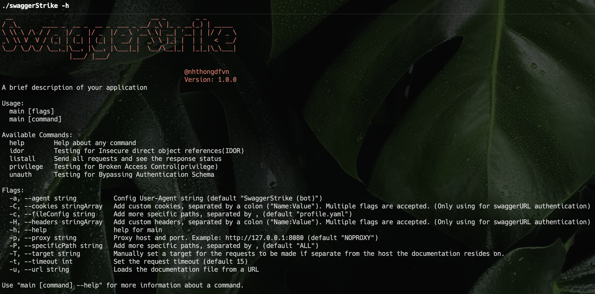

# SwaggerStrike
### How it works
The application is allowed to check for logic-related bugs based on the swagger or openAPI file. 
Applications can perform functions:
- Lists all the states of the endpoints
- Find unauthenticated endpoints
- Find IDOR endpoint
- Find endpoints with authorization bugs.

The application is designed for:
- Security engineer: provides functions that support the process of finding logic-related bugs.
- Software development: Provides automated testing functionality to perform logic-related bug testing.

### Install
- Build: To compile from source, ensure you have Go version >= 1.20 installed and run go build from within the repository:
```
$ git clone https://github.com/nhthongDfVn/SwaggerStrike.git
$ cd SwaggerStrike
$ go build .
```
### Usage

Some notes for you: 
- In case your swagger URL has authentication, you can use flag `cookies` and `headers` to authenticate swagger request.
```
swaggerStrike listall -H 'X-api-key:821398712389721823948' -C 'is_admin:false' -u "https://swagger.com/swagger" -T 'https://gw.swagger.com/api/v1/'
```
- Multi flags are accepted. 

CLI command line: 
- List all status
```
swaggerStrike listall -u "https://swagger.com/swagger" -T 'https://api.swagger.com/api/v1/'
```
In case you want to test with a valid or invalid token: please change the auth information in `profile.yaml`. We will use the first profile for this action

- List all unauthenticated endpoint
```
swaggerStrike unauth -u "https://swagger.com/swagger" -T 'https://api.swagger.com/api/v1/'
```

- List all Insecure Direct Object References (IDOR) endpoints.
```
swaggerStrike idor -u "https://swagger.com/swagger" -T 'https://api.swagger.com/api/v1/'
```

- List all Broken Access Control(privilege) endpoint.
```
swaggerStrike privilege -u "https://swagger.com/swagger" -T 'https://api.swagger.com/api/v1/'
```


### How to write `profile.yaml`.
We have some parts: `id`, `info`, `profiles`,`parameters`,`decentralization` and `unauthorized_response`


**id**
- You can input any string. Example: "test profile"

**info**
- You need to input `name`,`author` and `description` field.

**profiles**
For each profile, we have for  each part using for authentication(or any parameter you want to add to the request). 
We have four parts for you:
- `header`: add param in the header. Format: `param: value`
- `cookie`: add a cookie.  Format: `param: value`
- `query` : add a query in the path. Format: `param: value`
- `data`  : add data in body. Format: `param: value`

Multi values are accepted. 

**parameters**
- According to the program, values will be assigned randomly. However, if you have specified values for the parameters, you can specify them in this section.
- Some formats you can use:
	- `1-100` : The value will be random in range 1-100. Some formats you can use:
	- `112,839,3838` : we will random a value in the list. Very useful when we detect security vulnerabilities for the parameter has a non-random value
	- `111` : okay, we have no other choice... Choose your value 

- All values split by `-` or `,`. 

**decentralization**
- In this section, we provide a function that allows you to check privilege escalation errors in functions based on previously set profiles.
- Some formats you can use:
	- **Important:** For each profile, you list all endpoint that **this profile can accessiable**
	- You can input a specific path or wildcard part(\*) that is accepted.
	- You only input the path, not input `target` endpoint. 

**unauthorized_response**
- This section, which contains information about the strings contained in unauthenticated requests, helps you reduce the rate of false positives. 


See `profile.yaml` for more info.
### Plan
- [ ] Support write output with `txt`, `json` and `sonarqube` output.
- [ ] Apply CI-CD scan
- [ ] Support content type: upload file and xml format  
- [ ] Scan based on Top 10 API security 2023

